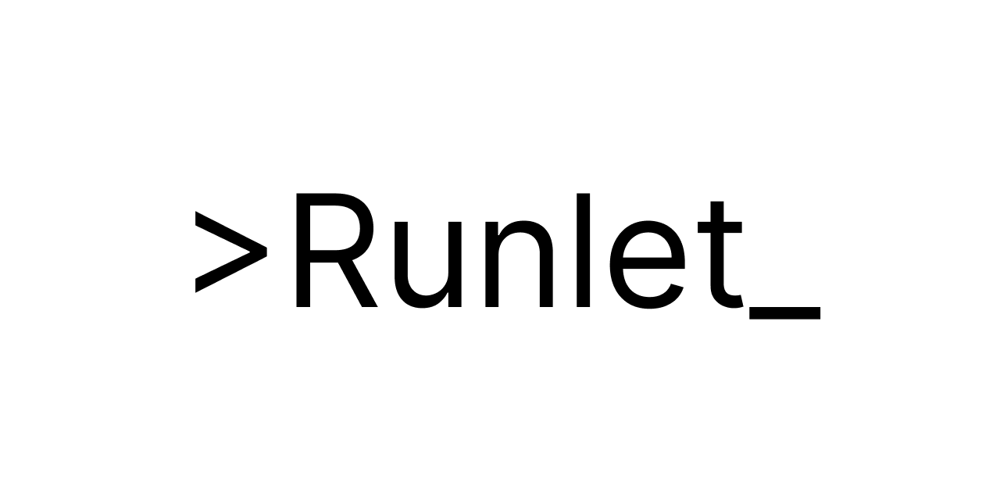

<p align="center">
  
</p>

Lightweight REST API for executing single-file code in a sandboxed environment. Supports Python, JavaScript (Node.js), C++, and Java.

Built to support [CodeAlong](https://github.com/GiridharRNair/CodeAlong). A platform for single file real-time collaborative code editing and execution.

## Architecture

<p align="center">
  
</p>

The service is hosted on a Digital Ocean droplet, where code changes are deployed through CI/CD pipelines managed by GitHub Actions. On the droplet, Caddy sits in front of the app as a reverse proxy and handles HTTPS automatically, so the app itself only has to speak plain HTTP internally.


The Docker image deployed on the droplet bakes in the runtimes for every supported language (Python, Node.js, g++, and the JDK), so no language installation happens at request time. Inside the app container, code isn't run directly on the host or in a per-request Docker container, it runs inside three isolated sandboxes built around [isolate](https://github.com/ioi/isolate), the sandbox built for the IOI programming contest.

## API Reference

API URL: `https://runlet.codealong.live`

| Method | Path        | Description                            |
| ------ | ----------- | --------------------------------------- |
| POST   | `/execute`  | Run a single file of code               |
| GET    | `/runtimes` | List supported languages and versions   |
| GET    | `/health`   | Health check                            |

### `POST /execute`

Request schema:

| Field      | Type   | Required | Description                                    |
| ---------- | ------ | -------- | ------------------------------------------------ |
| `language` | string | yes      | One of `python`, `javascript`, `cpp`, `java`      |
| `code`     | string | yes      | Source code to run                               |
| `stdin`    | string | no       | Input piped to the program, defaults to `""`     |

Response schema:

| Field    | Type          | Description                                    |
| -------- | ------------- | ------------------------------------------------ |
| `status` | string        | One of `OK`, `TLE`, `MLE`, `RE`, `CE`              |
| `stdout` | string        | Captured standard output                          |
| `stderr` | string        | Captured standard error                           |
| `time`   | float or null | Wall time used, in seconds                        |
| `memory` | int or null   | Peak memory used, in KB                           |

Example request:

```bash
curl -X POST https://runlet.codealong.live/execute \
  -H "Content-Type: application/json" \
  -d '{
    "language": "python",
    "code": "print(input())",
    "stdin": "hello"
  }'
```

Example response:

```json
{
  "status": "OK",
  "stdout": "hello\n",
  "stderr": "",
  "time": 0.031,
  "memory": 8192
}
```

### `GET /runtimes`

Example request:

```bash
curl https://runlet.codealong.live/runtimes
```

Response schema (list of):

| Field              | Type   | Description                     |
| ------------------- | ------ | --------------------------------- |
| `language_name`     | string | Display name of the language      |
| `language_version`  | string | Version of the language runtime   |

Example response:

```json
[
  { "language_name": "Python", "language_version": "3.13.14" },
  { "language_name": "JavaScript (Node.js)", "language_version": "20.19.2" },
  { "language_name": "C++ (g++)", "language_version": "14.2.0" },
  { "language_name": "Java", "language_version": "21.0.11" }
]
```

### `GET /health`

Example request:

```bash
curl https://runlet.codealong.live/health
```

Response schema:

| Field    | Type   | Description         |
| -------- | ------ | --------------------- |
| `status` | string | Always `healthy`      |

Example response:

```json
{
  "status": "healthy"
}
```

## Running locally

Requires [uv](https://docs.astral.sh/uv/) and Docker.

```bash
uv sync
docker compose -f docker-compose.dev.yml up
```

This starts the API with hot reload at `http://localhost:8000`.

> **Note on CGROUPS:** `docker-compose.dev.yml` sets `USE_CGROUPS=false`. Cgroups are a Linux kernel feature that `isolate` uses to enforce memory limits on sandboxed code, and they aren't available the same way on macOS (Docker Desktop runs containers inside a Linux VM, which doesn't expose cgroup control to the container like a native Linux host does). This project is developed on macOS, so cgroups are disabled by default locally. With `USE_CGROUPS=false`, memory limits aren't enforced and the `MLE` status will never be returned. In production, `USE_CGROUPS=true` so memory limits are enforced normally.

## Configuration

Set via environment variables — see [`app/config.py`](app/config.py):

| Variable                    | Default | Description                                                          |
| ---------------------------- | ------- | ---------------------------------------------------------------------- |
| `TIME_LIMIT`                 | `5.0`   | Execution wall time limit (seconds)                                   |
| `MEMORY_LIMIT`                | `256`   | Execution memory limit (MB)                                           |
| `COMPILE_TIME_LIMIT`          | `30.0`  | Compile step time limit (seconds), C++/Java                           |
| `COMPILE_MEMORY_LIMIT`        | `512`   | Compile step memory limit (MB), C++/Java                              |
| `MAX_BOXES`                   | `3`     | Number of concurrent isolate sandboxes                                |
| `USE_CGROUPS`                 | `true`  | Enforce memory limits via cgroups (disabled in `docker-compose.dev.yml`) |
| `CODE_EXECUTION_RATE_LIMIT`   | `10`    | Requests per minute allowed to `/execute` per IP                      |

## Tests and other commands

Common tasks are run through [Poe the Poet](https://poethepoet.natn.io/). Task definitions are in [`pyproject.toml`](pyproject.toml).

```bash
uv run poe format                  # format code with ruff
uv run poe lint                    # lint code with ruff
uv run poe test_python             # run Python language tests
uv run poe test_js                 # run JavaScript language tests
uv run poe test_cpp                # run C++ language tests
uv run poe test_java               # run Java language tests
uv run poe test_all_langs          # run all language tests
uv run poe test_memory_limit       # run memory limit tests against the local API
uv run poe test_prod_memory_limit  # run memory limit tests against the production API
```

The language tests hit a running instance of the API over HTTP. They use the `API_URL` environment variable, defaulting to `http://localhost:8000` if it isn't set, so start the API locally first (see "Running locally" above) before running them.

## License

This project is licensed under the MIT License. Open to contributions!
