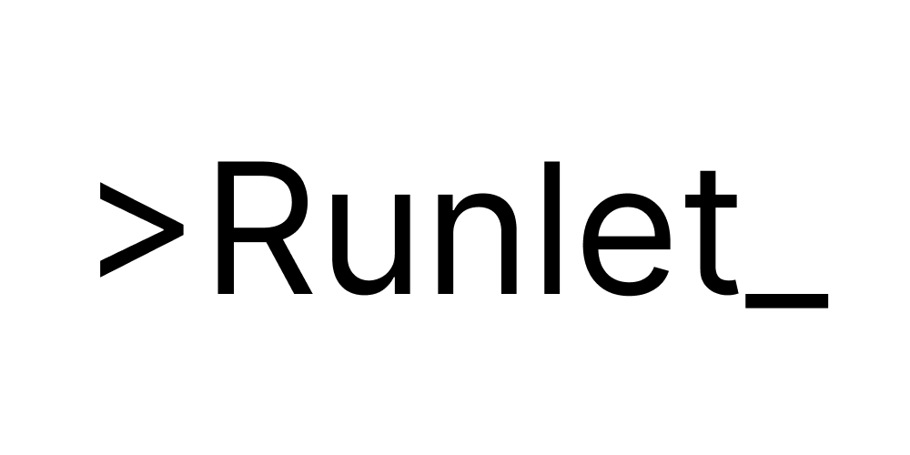
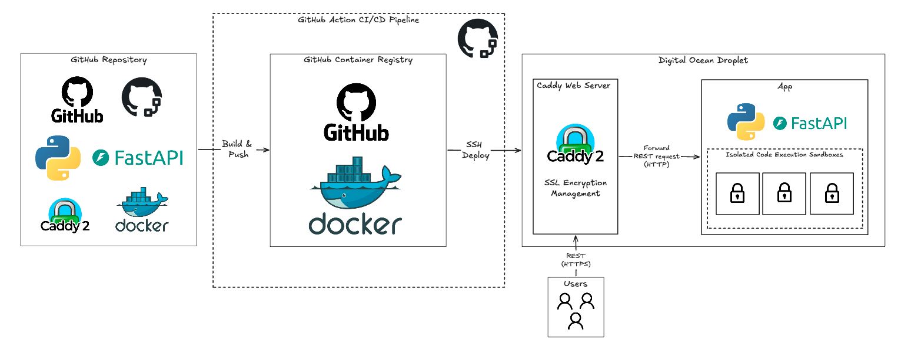

<p align="center">
  
</p>

Minimal REST API for executing single-file code in a sandboxed environment. Supports Python, JavaScript (Node.js), C++, and Java.

Built to support [CodeAlong](https://github.com/GiridharRNair/CodeAlong). A platform for single file real-time collaborative code editing and execution.

## Architecture

<p align="center">
  
</p>

The service is hosted on a Digital Ocean Droplet, where code changes are deployed through CI/CD pipelines managed by GitHub Actions. On the Droplet, Caddy sits in front of the app as a reverse proxy and handles HTTPS automatically, so the app itself only has to speak plain HTTP internally.

The Docker image deployed on the Droplet bakes in the runtimes for every supported language (Python, Node.js, g++, and the JDK), so no language installation happens at request time. 

Inside the app container, code isn't run directly on the host or in a per-request Docker container; it runs inside one of the three isolated sandboxes built around [isolate](https://github.com/ioi/isolate), a sandbox originally built for the IOI programming contest.

## API Reference

API URL: `https://runlet.codealong.live`

You can also access the OpenAPI spec at `https://runlet.codealong.live/openapi.json` or the Swagger UI at `https://runlet.codealong.live/docs`.

| Method | Path        | Description                            | Rate limit |
| ------ | ----------- | --------------------------------------- | ---------- |
| POST   | `/execute`  | Run a single file of code               | 10/minute  |
| GET    | `/runtimes` | List supported languages and versions   | 10/minute  |

### `POST /execute`

Runs one submission inside a sandbox and returns its result.

Request schema:

```json
{
  "language": "python | javascript | cpp | java",
  "code": "string",
  "stdin": "string, optional, defaults to \"\""
}
```

Response schema:

```json
{
  "status": "OK | TLE | MLE | RE | CE",
  "stdout": "string",
  "stderr": "string",
  "time": "float | null, seconds",
  "memory": "int | null, KB"
}
```

Example request:

```bash
curl -X POST https://runlet.codealong.live/execute \
  -H "Content-Type: application/json" \
  -d '{
    "language": "python",
    "code": "print(input())",
    "stdin": "hello"
  }'
```

Example response:

```json
{
  "status": "OK",
  "stdout": "hello\n",
  "stderr": "",
  "time": 0.031,
  "memory": 8192
}
```

`status` values:

| Status | Meaning                                                     |
| ------ | -------------------------------------------------------------- |
| `OK`   | Ran successfully                                                |
| `TLE`  | Time limit exceeded                                             |
| `MLE`  | Memory limit exceeded (only enforced when `USE_CGROUPS=true`)  |
| `RE`   | Runtime error (non-zero exit, signal, etc.)                     |
| `CE`   | Compile error (C++ and Java only)                               |

Other responses:

- `422` — body failed validation (e.g. `language` isn't one of the four supported values)
- `500` — the sandbox itself failed to run the submission, `{"detail": "<error>"}`

### `GET /runtimes`

Lists the language runtimes baked into the Docker image. No request body.

Response schema:

```json
[
  {
    "language_name": "string",
    "language_version": "string"
  }
]
```

Example request:

```bash
curl https://runlet.codealong.live/runtimes
```

Example response:

```json
[
  { "language_name": "Python", "language_version": "3.13.14" },
  { "language_name": "JavaScript (Node.js)", "language_version": "20.19.2" },
  { "language_name": "C++ (g++)", "language_version": "14.2.0" },
  { "language_name": "Java", "language_version": "21.0.11" }
]
```

## Local Development

Make sure you have the following installed:

- [Docker](https://docs.docker.com/get-docker/)
- [Python 3.13+](https://www.python.org/downloads/)
- [uv](https://docs.astral.sh/uv/) 

1. Install dependencies

```bash
uv sync
```

2. Start the API in development mode

```bash
docker compose -f docker-compose.dev.yml up
```

The API with hot reload will be available at `http://localhost:8000`.

> [!NOTE]  
> The Docker compose in development sets the environment variable `USE_CGROUPS` to false. 
>
> [Isolate](https://github.com/ioi/isolate) uses cgroups, a Linux kernel feature, to enforce memory limits, but Docker Desktop on macOS (used for local development) doesn't expose cgroup control the way a native Linux host does. 
>
> With cgroups disabled, memory limits aren't enforced and `MLE` is never returned locally. In production, `USE_CGROUPS` is set to true and enforces memory limits normally.

## Configuration

Set via environment variables — see [`app/config.py`](app/config.py):

| Variable                    | Default | Description                                                          |
| ---------------------------- | ------- | ---------------------------------------------------------------------- |
| `TIME_LIMIT`                 | `5.0`   | Execution wall time limit (seconds)                                   |
| `MEMORY_LIMIT`                | `256`   | Execution memory limit (MB)                                           |
| `COMPILE_TIME_LIMIT`          | `30.0`  | Compile step time limit (seconds), C++/Java                           |
| `COMPILE_MEMORY_LIMIT`        | `512`   | Compile step memory limit (MB), C++/Java                              |
| `MAX_BOXES`                   | `3`     | Number of concurrent isolate sandboxes                                |
| `USE_CGROUPS`                 | `true`  | Enforce memory limits via cgroups (disabled in `docker-compose.dev.yml`) |
| `CODE_EXECUTION_RATE_LIMIT`   | `10`    | Requests per minute allowed to `/execute` per IP                      |

## Tests and other commands

Common tasks are run through [Poe the Poet](https://poethepoet.natn.io/). Task definitions are in [`pyproject.toml`](pyproject.toml).

```bash
uv run poe format                  # format code with ruff
uv run poe lint                    # lint code with ruff
uv run poe test_python             # run Python language tests
uv run poe test_js                 # run JavaScript language tests
uv run poe test_cpp                # run C++ language tests
uv run poe test_java               # run Java language tests
uv run poe test_all_langs          # run all language tests
uv run poe test_memory_limit       # run memory limit tests against the local API
uv run poe test_prod_memory_limit  # run memory limit tests against the production API
```

The tests hit a running instance of the API over HTTP. They use the `API_URL` environment variable, defaulting to `http://localhost:8000` if it isn't set, so start the API locally first (see "Local Development" above) before running them.

## License

This project is licensed under the [MIT](LICENSE) License. 
